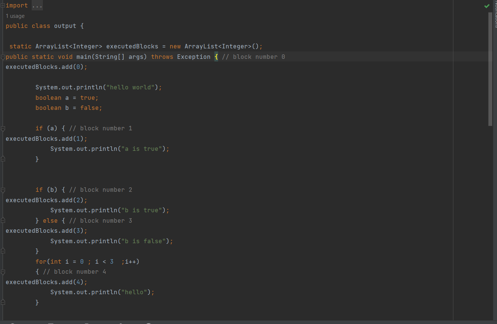
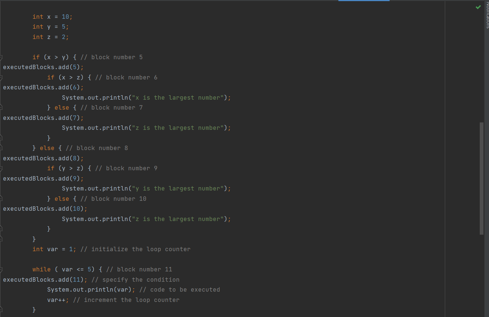
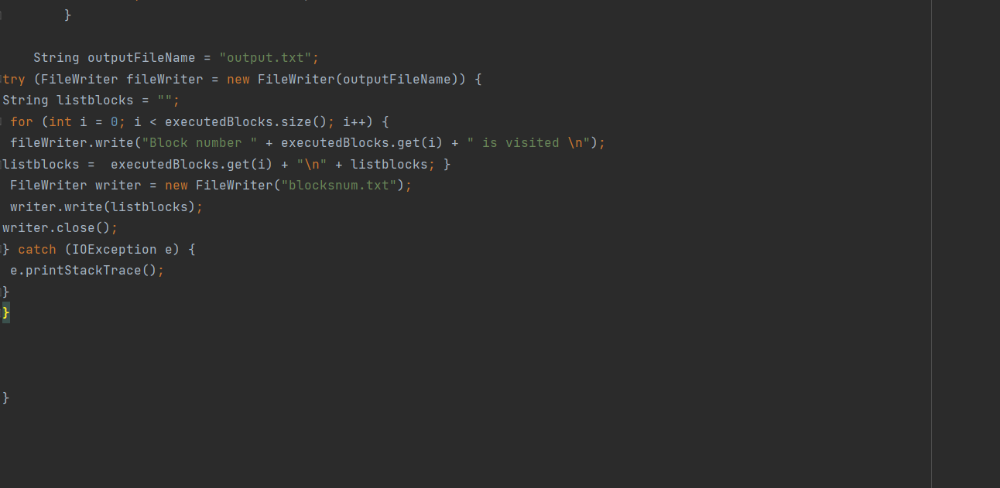
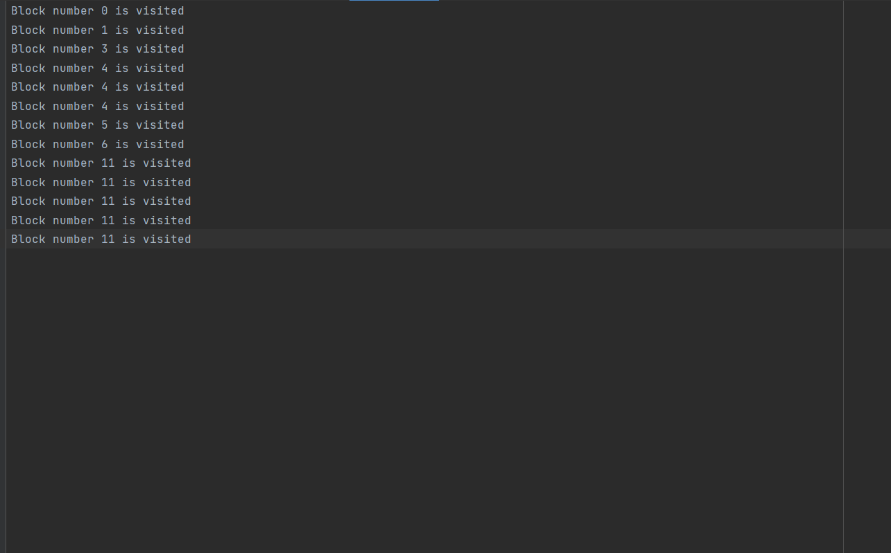

# compiler-project 

## How to run the program :
- make a clone of the repo.
- open the folder of the repo on an ide such as intelliJ.
- download antlr-4.9.3 (jar file).
- return to the ide then import the jar file to the project.
- make sure that all modules are added to the project. 
- run main.java.
## Here is the description of the project:

- Task 1 : Write a Java program based on Antlr that takes a java file as an input and outputs a
           modified intermediate java file (injected code) as demonstrated in the section
           where:
         you add comment in each block of this code indicates the number of this block , it
         should look like this :
        // block number 3
   ## Input file ag.java : 
   
   ``` 
   public class output {
    public static void main(String[] args) throws Exception {

        System.out.println("hello world");
        boolean a = true;
        boolean b = false;

        if (a) {
            System.out.println("a is true");
        }


        if (b) {
            System.out.println("b is true");
        } else {
            System.out.println("b is false");
        }
        for(int i = 0 ; i < 3  ;i++)
        {
            System.out.println("hello");
        }

        int x = 10;
        int y = 5;
        int z = 2;

        if (x > y) {
            if (x > z) {
                System.out.println("x is the largest number");
            } else {
                System.out.println("z is the largest number");
            }
        } else {
            if (y > z) {
                System.out.println("y is the largest number");
            } else {
                System.out.println("z is the largest number");
            }
        }
        int var = 1; // initialize the loop counter

        while ( var <= 5) { // specify the condition
            System.out.println(var); // code to be executed
            var++; // increment the loop counter
        }

    }
    }
    ``` 
    
 ## output file output.java : 
 
 
 
 
 
 
 
 - Task 2 : when you run The modified intermediate java file (generated from the previous step)
            to know which blocks of the code are visited (A file has to be generated after the
            program run that shows which blocks are visited).
            the file should look like this
            block number 1 is visited
            block number 3 is visited
            …
            
    ## Input file 
    output.java
    
    ## output file is output.txt
    
    
    
    
    
  - Task 3 : 
  Use the output from delivery 2 to generate an HTML with highlighted red/green lines
  Red lines are highlighted for not visited lines
 Green lines are highlighted for visited lines
 Make sure that your pipeline does not include any manual effort
  implement branch coverage

  ## Input file ag.java
  
  ``` 
   public class output {
    public static void main(String[] args) throws Exception {

        System.out.println("hello world");
        boolean a = true;
        boolean b = false;

        if (a) {
            System.out.println("a is true");
        }


        if (b) {
            System.out.println("b is true");
        } else {
            System.out.println("b is false");
        }
        for(int i = 0 ; i < 3  ;i++)
        {
            System.out.println("hello");
        }

        int x = 10;
        int y = 5;
        int z = 2;

        if (x > y) {
            if (x > z) {
                System.out.println("x is the largest number");
            } else {
                System.out.println("z is the largest number");
            }
        } else {
            if (y > z) {
                System.out.println("y is the largest number");
            } else {
                System.out.println("z is the largest number");
            }
        }
        int var = 1; // initialize the loop counter

        while ( var <= 5) { // specify the condition
            System.out.println(var); // code to be executed
            var++; // increment the loop counter
        }

    }
    }
  ```
  
  ##output files 
  
  1. output.java
  2. output.txt
  3. blocksnum.txt
  4. index.html
 
## output Index.html

 
 
 
 # Team members
> * Shrouk Abdallah  : [@Shrouk-Abdullah] (https://github.com/Shrouk-Abdullah)
> * Rana Osama :    [@RanaUsama20] (https://github.com/RanaUsama20)
> * Doha Khalid : [@dohakhaled33] (https://github.com/dohakhaled33) 
> * Maryam fathi : [@Mariam-Fathi] (https://github.com/Mariam-Fathi)
> * sara mohammed : [@sara823 ]   (https://github.com/sara823)

    
    

 
 
 
   
   


